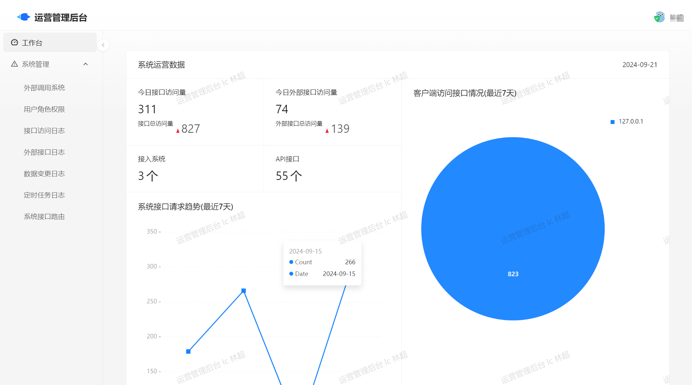
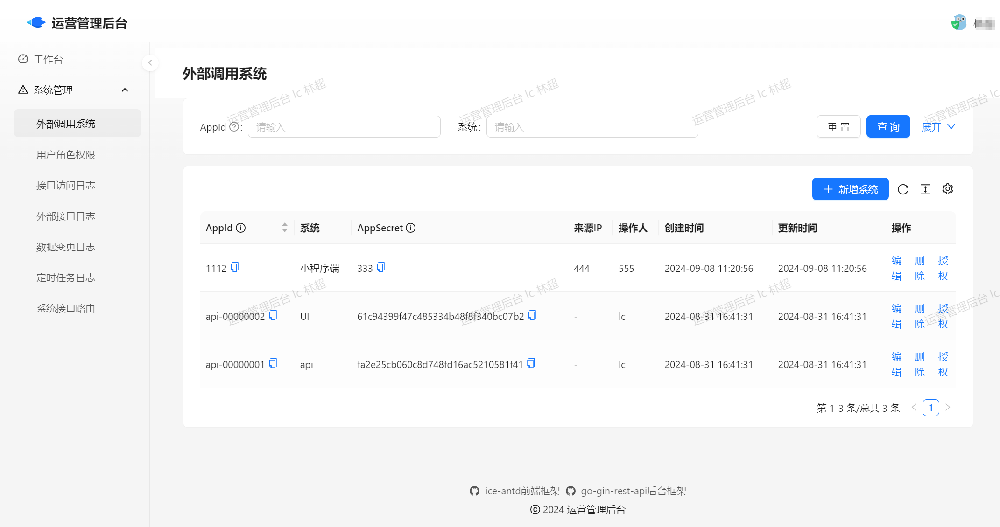

<h1 align="center">ice-antd</h1>

<div align="center">
ice.js 3 + Ant Design Pro 5实现的中后台React前端开发脚手架
<p align="center">


 
</p>
</div>

## 开发框架
- [ice.js](https://github.com/alibaba/ice) 阿里开源飞冰React框架 [文档](https://v3.ice.work/docs/guide/start)
- [Ant Design Pro](https://github.com/ant-design/pro-components) 蚂蚁开源Ant Design Pro前端UI组件 [文档](https://procomponents.ant.design/components)


## 编译运行

```bash
$ npm install

$ npm start

$ npm run build
```

## 目录结构

```md
.
├── README.md
├── ice.config.mts                  # The project config
├── package.json
├── .browserslistrc                 # Browsers that we support
├── public
│   ├── favicon.ico   
├── src
|  ├── app.ts                       # App entry
|  ├── assets
|  ├── components                   # Common component
|  ├── document.tsx
|  ├── global.css                   # Global style
|  ├── interfaces
|  ├── menuConfig.tsx               # Layout menus
|  ├── models
|  ├── pages                        # Pages directory
|  ├── services
|  ├── store.ts                     # App store
|  └── typings.d.ts
└── tsconfig.json
```
## 镜像构建部署

```bash
# 使用multi-stage(多阶段构建)需要docker 17.05+版本支持
DOCKER_BUILDKIT=1 docker build  --network=host --no-cache --force-rm -t registry.cn-shenzhen.aliyuncs.com/dev-ops/ice-antd:1.0.0 .
docker push  registry.cn-shenzhen.aliyuncs.com/dev-ops/ice-antd:1.0.0
docker save -o ice-antd-1.0.0.tar  registry.cn-shenzhen.aliyuncs.com/dev-ops/ice-antd:1.0.0
docker load -i ice-antd-1.0.0.tar
```
## 容器运行-Docker运行
``` shell
docker rm -f ice-antd
docker run -d --name ice-antd --network=host --restart always registry.cn-shenzhen.aliyuncs.com/dev-ops/ice-antd:1.0.0
```